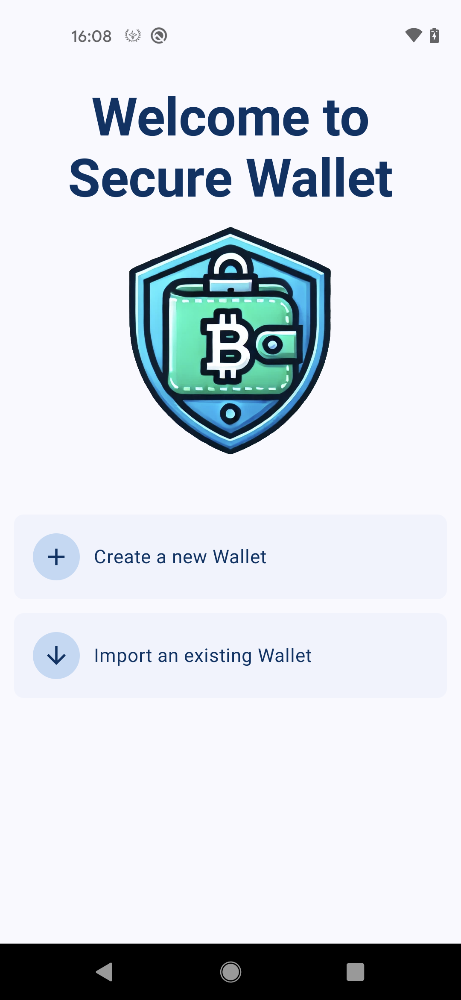
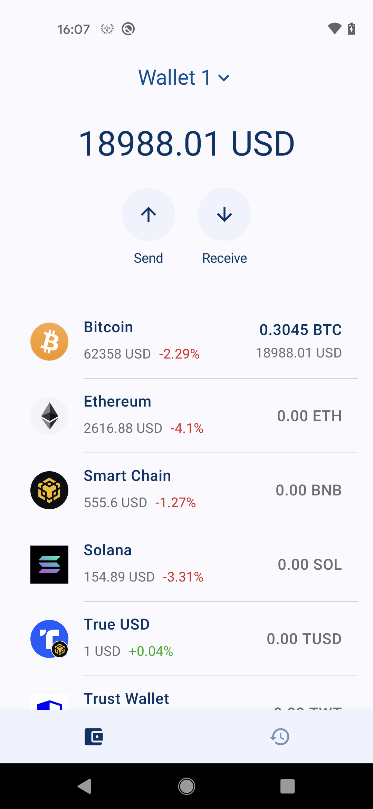
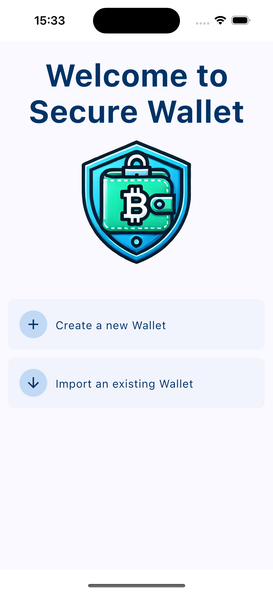
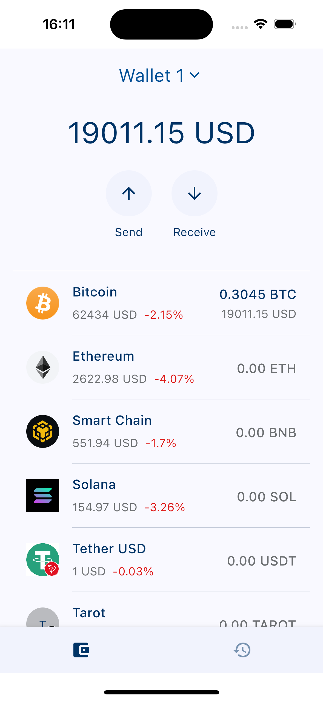

# Secure Wallet

Secure Wallet is a comprehensive cryptocurrency wallet designed designed for Android ans iOS. It provide users with a seamless and reliable way to manage their digital assets. With a focus on usability, Secure Wallet allows users to store, send, and receive a wide range of cryptocurrencies while ensuring the utmost protection of their private keys and sensitive information.

### Android Screenshots

<table>
  <td>
    <p align="center">
      
    </p>
  </td>
    <td>
    <p align="center">
      
    </p>
  </td>
</tr>
</table>

### iOS Screenshots

<table>
  <td>
    <p align="center">
      
    </p>
  </td>
    <td>
    <p align="center">
      
    </p>
  </td>
</tr>
</table>


## Disclaimer

This project was realised in a few days, it is not intended for production use. Secure Wallet is a demonstration project created to provide an overview of how to build a Kotlin Multiplatform (KMP) project using an MVI (Model-View-Intent) architecture in a multi-module setup. It has been developed solely to showcase my coding skills.

While the project is functional, it is essential to note that it has not undergone extensive testing and may require additional fixes and optimizations. If you plan to use this project as a foundation for a production application, it is strongly recommended to allocate more time for thorough testing and improvements.

> [!IMPORTANT]
>  To use Trust Wallet Core in this project, you need to add the following properties to your local.properties file after generating a GitHub token:
> ```
>gpr.user=YOUR_GITHUB_USERNAME
>gpr.key=YOUR_GITHUB_TOKEN
> ```
> You can generate the token on GitHub and find more information on the integration guide [here](https://developer.trustwallet.com/developer/wallet-core/integration-guide/android-guide#adding-library-dependency)


## Project Setup & Environment

#### Requirements
- Java 17
- You require the latest [Android Studio](https://developer.android.com/studio/preview) release to be able to build the app.
- Install KMM Plugin. Checkout [this setup guide](https://kotlinlang.org/docs/multiplatform-mobile-setup.html).

### Opening iOS Project
- Navigate to the ios directory & open `.xcodeproj`


## Architecture
The app architecture has three layers: a data layer, a domain layer and a UI layer. Secure Wallet use MVI architecture, it provides a unidirectional data flow (UDF), allowing you to handle state changes and propagate them to the UI efficiently.

## Single source of truth
When a new data type is defined in your app, you should assign a Single Source of Truth (SSOT) to it. The SSOT is the owner of that data, and only the SSOT can modify or mutate it. To achieve this, the SSOT exposes the data using an immutable type, and to modify the data, the SSOT exposes functions or receive events that other types can call.

This pattern brings multiple benefits:

It centralizes all the changes to a particular type of data in one place.
It protects the data so that other types cannot tamper with it.
It makes changes to the data more traceable. Thus, bugs are easier to spot.
In an offline-first application, the source of truth for application data is typically a database. In some other cases, the source of truth can be a ViewModel or even the UI.

## Technology

- [Kotlin](https://kotlinlang.org)
- [Compose Multiplatform](https://www.jetbrains.com/lp/compose-multiplatform)
- [Kotlin Coroutine](https://kotlinlang.org/docs/coroutines-overview.html)
- [Swift](https://www.swift.org)
- [SqlDelight](https://github.com/cashapp/sqldelight)
- [Koin](https://insert-koin.io)
- [Multiplatform Settings](https://github.com/russhwolf/multiplatform-settings)
- [Kamel](https://github.com/Kamel-Media/Kamel)
- [Spotless](https://github.com/diffplug/spotless)
- [Voyager](https://voyager.adriel.cafe/)
- [Coroutines](https://github.com/Kotlin/kotlinx.coroutines#multiplatform)
- [DataStore Preferences](https://android-developers.googleblog.com/2022/10/announcing-experimental-preview-of-jetpack-multiplatform-libraries.html)
- [DateTime](https://github.com/Kotlin/kotlinx-datetime)
- [Ktor](https://ktor.io/)
- [Wallet core](https://github.com/trustwallet/wallet-core)
- [Bignum](https://github.com/ionspin/kotlin-multiplatform-bignum)
- [qrKit](https://github.com/Chaintech-Network/QRKitComposeMultiplatform)

## Modularization
Modularization is the practice of breaking the concept of a monolithic, one-module codebase into loosely coupled, self contained modules.

A barebone module is simply a directory with a Gradle build script inside. Usually though, a module will consist of one or more source sets and possibly a collection of resources or assets. Modules can be built and tested independently. Due to Gradle's flexibility there are few constraints as to how you can organize your project. In general, you should strive for low coupling and high cohesion.

Low coupling - Modules should be as independent as possible from one another, so that changes to one module have zero or minimal impact on other modules. They should not possess knowledge of the inner workings of other modules.
High cohesion - A module should comprise a collection of code that acts as a system. It should have clearly defined responsibilities and stay within boundaries of certain domain knowledge.


## Contact with me

💬  If you have any question / feedback, please do not hesitate to reach out to me in linkedin:

[](https://www.linkedin.com/in/christophe-da-costa-72225553/)
